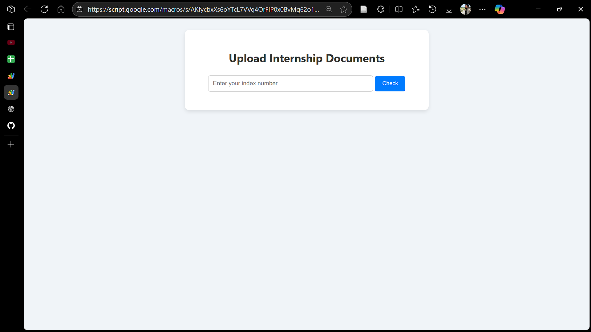
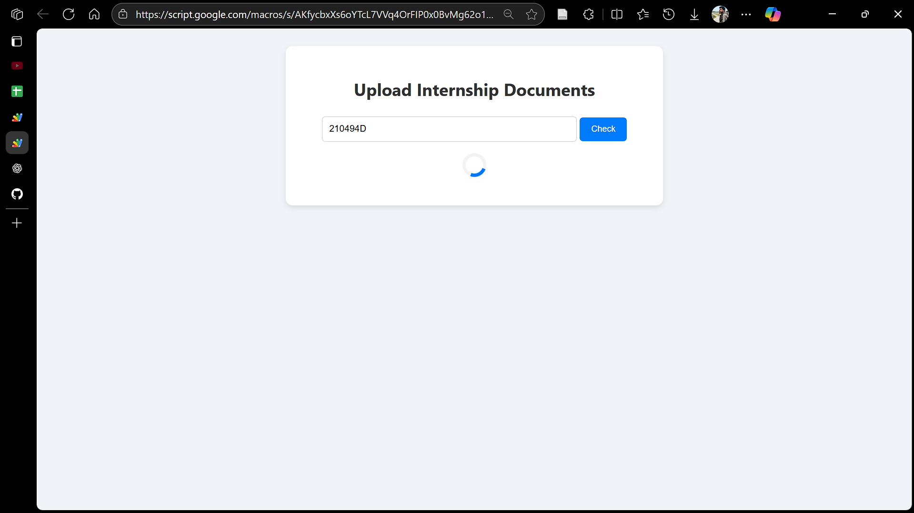
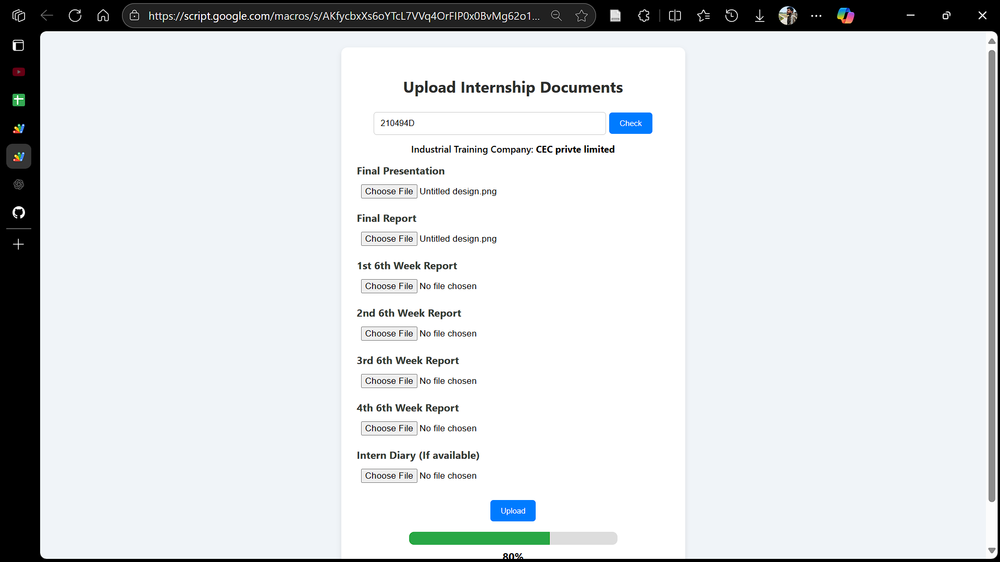
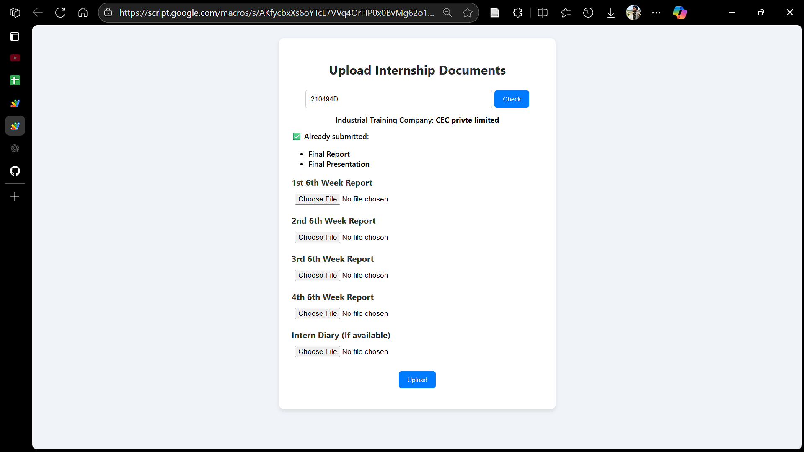

## 📁 Internship Document Upload System (Google Apps Script Web App)

This web app was developed to streamline the submission of internship-related documents by students.

## 🚀 Project Features

- ✅ Index validation against a Google Sheet
- 🏢 Automatically identifies student’s company
- 📁 Creates nested folder structure in Google Drive
- 📤 Allows multiple file uploads with specific naming formats
- 🔁 Handles partial submissions (retries allowed)
- ⏳ Progress bar and success feedback UI
- ✅ Updates submission status (✓ or "Not Complete") in Google Sheet

## 🛠️ Technologies Used

- **Google Apps Script** (Backend logic, Drive & Sheet access)
- **HTML / CSS / JavaScript** (Frontend UI)
- **Google Drive API & SpreadsheetApp**

## 📂 File Structure

| File       | Description                                                   |
|------------|---------------------------------------------------------------|
| Code.gs    | All backend logic (index check, upload, Drive, Sheets)        |
| index.html | Frontend UI + JavaScript (user interaction, upload, feedback) |

## 📸 Screenshot

The user is presented with a clean, mobile-responsive interface to begin the document upload process by entering their index number.

A loading animation is displayed after the user submits their index number, indicating background verification of student and company data from the spreadsheet.

After successful verification, the student's assigned company is shown along with dynamic file upload fields. Already uploaded documents are displayed, and missing ones are enabled for submission.

The app detects previously submitted documents and displays them as ✅ submitted, while only showing remaining file inputs. The student can upload the pending documents without re-submitting existing ones.

## 💡 How it Works

1. Student enters their index number
   → App fetches associated company from the Sheet.

2. Student uploads documents
   → Required: 6 fixed types; Optional: Intern diary.

3. Files are saved like: 
   `index_finalPresentation.pdf`  
   inside `Industrial Training / Company Name / [Index]` folders.

4. Google Sheet updates  
   - If all 6 required files uploaded → Column C = `✓`  
   - Else → Column C = `Not Complete`

5. Handles Re-Uploads 
   - Already uploaded files are detected and skipped  
   - Missing files only are requested again

## 📝 Notes

- This repo is for showcasing code structure only.  
- Deployment is done through Google Apps Script Editor using [https://developers.google.com/apps-script].

## 📄 License

MIT
